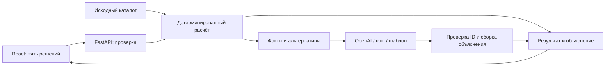

# Аким на 5 часов

AI-симулятор распределения городского бюджета Астаны: **5 решений, бюджет 100, итоговый Astana Quality of Life Score с объяснением от AI**.

An educational city budget simulator: choose five interventions and compare their impact across five synthetic districts of Astana. All scores are calculated deterministically; AI selects explanations from verified facts. You can run the application locally without an API key, using saved AI selections or an explicitly labelled template.

## Быстрый старт

### Docker — рекомендуемый способ

Требуются **Git**, доступ к этому репозиторию и работающий **Docker с Linux-контейнерами**. На Windows/macOS подойдёт Docker Desktop; на Linux — Docker Engine. Минимальная версия Docker в проекте не закреплена. Python и Node.js на компьютере не нужны: [Dockerfile](deploy/Dockerfile) использует Python 3.12 и Node.js 22. Первая сборка требует интернета для загрузки образов и зависимостей.

Команды одинаковы для **Windows PowerShell и Linux/macOS**. Начните в папке, в которой ещё нет каталога `hack-8385c555-kunnurs`:

```text
git clone --branch main https://github.com/BAITC-Hacks/hack-8385c555-kunnurs.git
```

Из той же папки перейдите в клон:

```text
cd hack-8385c555-kunnurs
```

Из корня клона соберите образ:

```text
docker build -f deploy/Dockerfile -t akim-city:local .
```

Из корня клона запустите приложение **без API-ключа**:

```text
docker run --rm --name akim-city -p 127.0.0.1:8000:8000 -e PORT=8000 -e AI_MODE=live -e OPENAI_MODEL=gpt-4.1-mini akim-city:local
```

После сообщения `Uvicorn running` откройте **[http://127.0.0.1:8000](http://127.0.0.1:8000)**. Терминал должен оставаться открытым. Остановка — **Ctrl+C**; временный контейнер удалится, собранный образ останется.

Контрольный пример использует сохранённый AI-разбор. Для сценария без сохранённого ответа появится явно обозначенный шаблон; расчёт и рекомендации продолжат работать. Собственный ключ подключается в разделе [AI-режимы](#ai-режимы). Публичный деплой для проверки проекта не требуется.

### Python + Node.js — локальная разработка

Требуются **Git, Python 3.12, Node.js 22.12+ с npm**. В lock-файле Vite допускает Node.js `^20.19.0 || >=22.12.0`; здесь выбран профиль Node.js 22.12+. Локальные OPS-проверки выполнялись также на Python 3.13.14 и Node.js 24.19.0. Для установки зависимостей нужен интернет. После установки инструментов откройте новый терминал.

Сначала выполните `git clone` и переход в клон из предыдущего раздела. Все команды этого подраздела выполняются **из корня клона**. Этот способ запускается отдельно от Docker: порт 8000 должен быть свободен.

#### Windows — PowerShell

Создайте окружение:

```powershell
py -3.12 -m venv .venv
```

Установите Python-зависимости:

```powershell
.\.venv\Scripts\python.exe -m pip install -r requirements.txt
```

Создайте конфигурацию backend, сохранив существующий файл, если он уже есть:

```powershell
if (-not (Test-Path .env)) { Copy-Item .env.example .env }
```

Создайте конфигурацию frontend:

```powershell
if (-not (Test-Path frontend/.env.local)) { Copy-Item frontend/.env.example frontend/.env.local }
```

Установите frontend-зависимости по lock-файлу:

```powershell
npm.cmd --prefix frontend ci
```

**Терминал 1, корень клона:**

```powershell
.\.venv\Scripts\python.exe -m uvicorn backend.app.main:app --host 127.0.0.1 --port 8000
```

**Терминал 2, корень клона:**

```powershell
npm.cmd --prefix frontend run dev -- --port 5173 --strictPort
```

#### Linux/macOS — bash/zsh

Из **корня клона** создайте окружение; команда предполагает установленный Python 3.12:

```bash
python3.12 -m venv .venv
```

Установите Python-зависимости:

```bash
.venv/bin/python -m pip install -r requirements.txt
```

Создайте конфигурацию backend:

```bash
if [ ! -f .env ]; then cp .env.example .env; fi
```

Создайте конфигурацию frontend:

```bash
if [ ! -f frontend/.env.local ]; then cp frontend/.env.example frontend/.env.local; fi
```

Установите frontend-зависимости:

```bash
npm --prefix frontend ci
```

**Терминал 1, корень клона:**

```bash
.venv/bin/python -m uvicorn backend.app.main:app --host 127.0.0.1 --port 8000
```

**Терминал 2, корень клона:**

```bash
npm --prefix frontend run dev -- --port 5173 --strictPort
```

Для обеих ОС откройте **[http://127.0.0.1:5173](http://127.0.0.1:5173)**. Backend и интерактивная документация доступны на **[http://127.0.0.1:8000/docs](http://127.0.0.1:8000/docs)**. Остановка — Ctrl+C в обоих терминалах. Активировать виртуальное окружение не требуется: команды используют его Python напрямую.

## Как убедиться, что всё работает

1. Откройте приложение по адресу выбранного способа запуска и выберите **RU** в шапке.
2. В разделе **«Соберите свой сценарий»** нажмите **«Пример из задания»**. Начальная форма уже содержит этот набор; кнопка восстанавливает его после изменений.
3. Сверьте пять карточек:

   | Карточка | Мера | Район |
   |---|---|---|
   | 01 | M7 | Нура |
   | 02 | M8 | Нура |
   | 03 | M10 | Нура |
   | 04 | M12 | Весь город |
   | 05 | M5 | Сарыарка |

   Чтобы выбрать меру вручную, нажмите поле **«Мероприятие»**, введите её ID в поиск и нажмите вариант. Район выбирается соседним полем. У M12 поле района отключено и показывает **«Весь город»**.
4. До расчёта исходный Score — **52.56**. Предварительная стоимость набора — **95 / 100**, остаток — **5**.
5. Нажмите **«Рассчитать и получить AI-анализ»**. Ожидайте **Score 56.54**, прирост **+3.99**, **критических показателей 0**. В разделе **«Почему получился такой результат»** появятся объяснение, риски и варианты улучшения. Ожидание живого AI ограничено 30 секундами; клиент ждёт до 35 секунд.
6. В разделе **«Проверьте другой набор»** нажмите **«Сохранить для сравнения»**. Перенесите только M7 в **Есиль** и рассчитайте снова: **Score 55.30**, критических показателей **1**. Сравнение покажет изменение результата.

Точные значения API: база `52.55768`, пример `56.54307`, перенос M7 `55.29777`. Интерфейс округляет до двух знаков. Источники: [исходный сценарий](data/scenarios/pdf-example.json), [сценарий с переносом школы](data/scenarios/school-in-esil.json), [расчёт](backend/app/services/simulation.py).

<!-- Место для скриншота docs/screenshots/control-scenario.png: набор 95/100, Score 56.54, критических 0. -->
<!-- Место для скриншота docs/screenshots/scenario-comparison.png: сравнение 56.54 и 55.30. -->

## AI-режимы

Score, бюджет, эффекты и альтернативы рассчитываются одинаково во всех режимах. Метка под анализом показывает источник объяснения:

| Режим / источник API | Что происходит |
|---|---|
| `live / provider` | Выполнен новый запрос к OpenAI; ответ прошёл серверную проверку. |
| `live / cache` | Использованы сохранённые проверенные ID фактов. Нового вызова модели нет. |
| `mock / template` | При `AI_MODE=mock` сервер формирует шаблон без вызова модели. |
| `fallback / template` | Нет ключа, неверна конфигурация, произошла ошибка или ответ не прошёл проверку; причина находится в `analysis.reason`. |

В актуальном main есть `ai/demo_cache.json`: сохранённые выборы фактов для трёх демонстрационных сценариев из `scripts/demo_scenarios.py`, включая контрольный пример. Кэш привязан к модели, версии промпта, данным и расчёту; при `OPENAI_MODEL=gpt-4.1-mini` он доступен **без ключа**. Числа при каждом запросе вычисляются заново. Кроме файла существует кэш процесса: до 128 записей, срок 1 час; файл переживает перезапуск.

`/api/health` проверяет конфигурацию, поэтому без ключа может показывать `fallback`, даже когда конкретный анализ успешно использует `live/cache`. Фактический источник смотрите в ответе `/analyze` и в интерфейсе.

### Подключение собственного ключа

Проверяющий использует **свой API-ключ** с доступом к выбранной модели и доступной API-квотой. Командный ключ в репозитории отсутствует; `.env` исключён из Git и Docker-образа.

Для Docker сначала создайте `.env` **в корне клона**; для локального запуска файл уже создан выше.

Windows PowerShell, корень клона:

```powershell
if (-not (Test-Path .env)) { Copy-Item .env.example .env }
```

Linux/macOS, корень клона:

```bash
if [ ! -f .env ]; then cp .env.example .env; fi
```

Откройте `.env` в текстовом редакторе и впишите только свой ключ после `OPENAI_API_KEY=`. Пример уже задаёт `AI_MODE=live` и `OPENAI_MODEL=gpt-4.1-mini`. Не помещайте ключ в `frontend/.env.local`.

**Docker:** остановите предыдущий запуск через Ctrl+C. Затем из корня клона выполните одинаковую для всех ОС команду. Она отключает кэш, чтобы первый анализ проверял именно доступ к провайдеру:

```text
docker run --rm --name akim-city -p 127.0.0.1:8000:8000 --env-file .env -e PORT=8000 -e AI_MODE=live -e OPENAI_MODEL=gpt-4.1-mini -e AI_CACHE_ENABLED=false akim-city:local
```

Повторите контрольный сценарий в браузере. Ожидаемая метка — **«AI · ответ модели»**, поля API — `mode=live`, `source=provider`, `reason=null`. Этот запуск обращается к API при каждом анализе. После проверки для обычного запуска с кэшем остановите контейнер через Ctrl+C и выполните из корня клона:

```text
docker run --rm --name akim-city -p 127.0.0.1:8000:8000 --env-file .env -e PORT=8000 -e AI_MODE=live -e OPENAI_MODEL=gpt-4.1-mini -e AI_CACHE_ENABLED=true akim-city:local
```

Обычный `docker restart` не загружает изменённый `.env`: контейнер нужно пересоздать.

**Python + Node.js:** после изменения `.env` остановите и заново запустите backend той же командой из быстрого старта. Для отдельной проверки нового ответа без кэша выполните конечную команду ниже **из корня клона в новом терминале**. Она не запускает сервер и может расходовать API-квоту.

Windows PowerShell:

```powershell
& { $previousMode = $env:AI_MODE; $previousCache = $env:AI_CACHE_ENABLED; try { $env:AI_MODE = 'live'; $env:AI_CACHE_ENABLED = 'false'; .\.venv\Scripts\python.exe -m scripts.check_ai } finally { $env:AI_MODE = $previousMode; $env:AI_CACHE_ENABLED = $previousCache } }
```

Linux/macOS:

```bash
AI_MODE=live AI_CACHE_ENABLED=false .venv/bin/python -m scripts.check_ai
```

Ожидается `{"mode":"live","source":"provider","reason":null,"score":56.54307}`. Пробелы JSON несущественны. При включённом кэше успешный выход `scripts.check_ai` может означать `source=cache`, поэтому одного кода выхода недостаточно для подтверждения нового обращения к модели.

### Переменные окружения

Источники: [.env.example](.env.example), [настройки AI](ai/settings.py), [backend](backend/app/main.py), [frontend API](frontend/src/api.js), [Dockerfile](deploy/Dockerfile).

| Переменная | Значение и поведение |
|---|---|
| `AI_MODE` | `live` или `mock`. В backend по умолчанию `live`, в Dockerfile — `mock`; команды выше явно выбирают `live`. |
| `OPENAI_API_KEY` | Нужен для нового запроса к провайдеру. Без него доступны расчёт, шаблон и подходящий демо-кэш. |
| `OPENAI_MODEL` | В примере `gpt-4.1-mini`. В live обязателен непустой ID; скрытого значения по умолчанию в коде нет. |
| `AI_TIMEOUT_SECONDS` | Общий срок вызова AI, по умолчанию 30 секунд; допустимо больше 0 и не больше 30. |
| `AI_REQUEST_TIMEOUT_SECONDS` | Таймаут обращения SDK, по умолчанию 25 секунд, максимум 30. Общий срок ограничивает также повтор. |
| `AI_CACHE_ENABLED` | По умолчанию `true`; `false` отключает чтение и запись кэша при анализе. |
| `AI_DEMO_CACHE_PATH` | Пустое значение использует `ai/demo_cache.json`. Произвольный относительный путь отсчитывается от рабочего каталога. |
| `CORS_ORIGINS` | Разрешённые адреса frontend через запятую. В примере `http://localhost:5173,http://127.0.0.1:5173`. |
| `PORT` | Используется командой запуска контейнера. В примере `.env` — `8001`, поэтому Docker-команды выше явно задают `8000`. В локальных командах порт задаёт `--port 8000`. |
| `VITE_API_URL` | Только frontend, файл `frontend/.env.local`: `http://localhost:8000`. В Docker при сборке задан `/` для запросов к тому же адресу. Изменение требует перезапуска Vite или пересборки. |
| `FRONTEND_DIST` | Необязательный путь к сборке для `deploy.app`; по умолчанию `frontend/dist`. В описанных способах менять не нужно. |

Backend читает корневой `.env`, но уже заданные переменные терминала имеют приоритет. Пустой ключ в `.env` не отменит ключ, ранее экспортированный в терминале.

## Что умеет продукт

- Выбор пяти мер из каталога 14 мероприятий; поиск по ID, названию и направлению; выбор района или городского действия.
- Предварительная и серверная проверка бюджета, числа решений, направлений, повторов и конфликтов.
- Итоговый Score, изменение относительно базы, результаты пяти районов, десять показателей выбранного района и критические значения.
- Объяснение сильных сторон, обязательных рисков и компромиссов с явным обозначением источника AI.
- До трёх проверенных альтернатив по лучшему Score, меньшей стоимости и меньшему числу критических значений; совпадающие варианты объединяются. **«Применить»** заменяет одну меру и пересчитывает сценарий.
- Сохранение одного результата в этом браузере и сравнение с новым; при другой версии датасета сравнение блокируется.
- Интерфейс **RU / ҚАЗ / EN** с сохранением языка. Серверные объяснения и компромиссы отображаются на русском с пояснением в других языках.

Исходники: [интерфейс](frontend/src/main.jsx), [компоненты](frontend/src/components), [валидация формы](frontend/src/scenario.js), [поиск альтернатив](backend/app/services/advice.py).

## Как это устроено

1. React получает исходный каталог и базовый результат через FastAPI.
2. Браузер отправляет только ID пяти мер и районов; сервер повторно проверяет все правила.
3. Python считает бюджет, эффекты, синергии, районные показатели и Score из неизменного исходного города.
4. Сервер перебирает допустимые замены одной меры и отдельно оценивает вклад решений удалением каждого из них.
5. AI выбирает ID из подготовленных фактов; Structured Outputs ограничивает допустимые значения, сервер проверяет их категории и отсутствие повторов.
6. Текст и числа формирует сервер. Обязательные риски и проверенные рекомендации включаются независимо от выбора модели; ошибочный ответ заменяется шаблоном.



Модель не получает инструментов для исполнения команд. Адрес провайдера фиксирован, `store=false`; перед отправкой текст проходит маскирование email, типовых телефонов и ИИН. В журнал ошибок выводится фиксированный код причины, без ключа и исходного ответа провайдера. Реализация: [ai/agent.py](ai/agent.py), [ai/evidence.py](ai/evidence.py), [ai/privacy.py](ai/privacy.py).

## Модель расчёта

Источник правил — [data/city.json](data/city.json); реализация — [simulation.py](backend/app/services/simulation.py).

- Ровно **5 разных мероприятий**, стоимость **≤100**, не больше **2 мер на направление**: минимум 3 направления. Остаток бюджета не увеличивает Score.
- M1/M3 несовместимы при любом выборе районов. M4/M7 и M5/M13 несовместимы в одном районе.
- Горизонт — **8 кварталов**. Реализованный эффект меры с лагом `L`: `эффект × (8 − L) / 8`. Городская мера действует на все пять районов.
- Синергии из каталога добавляются при наличии соответствующих пар мер; их бонусы не умножаются повторно на долю лага.
- После всех эффектов и синергий каждый показатель ограничивается диапазоном `[0, 100]`.
- Районный балл `Dᵢ = Σⱼ wⱼ × xᵢⱼ`; средний балл города `A = Σᵢ pᵢ × Dᵢ`, где веса показателей `w` и доли населения `p` заданы в каталоге.
- **`Score = 0.7 × A + 0.3 × min(Dᵢ) − N`**, где `N` — число пар «район, показатель» со значением строго **ниже 40**. Сам итоговый Score дополнительно не ограничивается диапазоном 0–100.

Порядок решений не влияет на результат. Промежуточные значения не округляются; API возвращает итоговые числа до 6 знаков, интерфейс показывает 2. Вклады отдельных мер учитывают потерю синергий и штрафов; их нельзя просто сложить для получения общего прироста.

## Соответствие критериям задания

В main есть отдельный набор [backend/tests/test_criteria.py](https://github.com/BAITC-Hacks/hack-8385c555-kunnurs/blob/f3be8b563072ec0ea32d9680dfab14fbac90e9ea/backend/tests/test_criteria.py). Ссылка закреплена на исследованной версии; тесты входят в общую команду проверки.

| Критерий | Как реализован | Реальный тест |
|---|---|---|
| Одинаковые бюджет и данные на старте | Бюджет 100, неизменный каталог, повторный расчёт из базы | `backend/tests/test_criteria.py::test_criterion_1` |
| Нельзя превысить бюджет | Проверки формы и API; сервер возвращает 422 без Score | `backend/tests/test_criteria.py::test_criterion_2` |
| Решения влияют на показатели | Лаг, эффекты и синергии изменяют показатели районов | `backend/tests/test_criteria.py::test_criterion_3` |
| AI объясняет результат и компромиссы | Проверенные факты, сильные стороны, обязательные риски, альтернативы и notice | `backend/tests/test_criteria.py::test_criterion_4`; [test_ai.py](backend/tests/test_ai.py) проверяет адаптер и защиту обязательных рисков |
| Другой набор даёт другой Score | Перенос M7 меняет 56.54307 на 55.29777 | `backend/tests/test_criteria.py::test_criterion_5` |

Тест четвёртого критерия проверяет структуру и содержание шаблонного fallback; проверки SDK используют подменённый транспорт. Новый ответ реального провайдера подтверждается отдельно по `live/provider`. Понятность объяснения для человека оценивается при ручном контрольном сценарии.

## Тесты

Установите Python- и frontend-зависимости по разделу локального запуска. Серверы для общей проверки не нужны. Все команды ниже — **из корня клона**.

Windows PowerShell:

```powershell
.\.venv\Scripts\python.exe scripts/check.py --require-frontend
```

Linux/macOS:

```bash
.venv/bin/python scripts/check.py --require-frontend
```

Команда проверяет контракт и backend, импорт приложения, OPS в mock и fallback, frontend unit-тесты и production-сборку. Ожидаемый финал — **`OK: checks passed`**. Автоматические сценарии изолируют личный ключ; провайдер подменяется или отключается.

| Набор | Покрытие |
|---|---|
| [contracts/tests](contracts/tests) | Схемы и JSON-примеры API |
| [backend/tests](backend/tests) | Формула, бюджет, лаги, синергии, конфликты, рекомендации, AI, кэш и пять критериев |
| [tests/e2e](tests/e2e) | API, валидация, offline/fallback, безопасность и упаковка |
| [frontend/src/scenario.test.js](frontend/src/scenario.test.js), [frontend/tests](frontend/tests) | Проверка формы, применение альтернатив, устаревшие советы и переводы |

Для исследованного main `f3be8b5` состав наборов: **89** основных, **80** OPS mock, **32** fallback и **10** frontend unit. 32 fallback-проверки повторяют часть API-набора в другом режиме; это не дополнительные уникальные тесты. OPS-ветка содержит дополнительные проверки, поэтому её числа отличаются. Источники результатов и границы проверки: [отчёт README](docs/readme-review.md), [журнал команды](AI_USAGE.md).

Проверку установки из пустой папки на Windows и Linux/macOS нужно выполнять буквальным копированием команд быстрого старта. Автоматический прогон на уже подготовленном компьютере не подтверждает установку из чистого клона.

## API

| Метод | Путь | Назначение |
|---|---|---|
| GET | `/api/health` | Готовность сервиса, версия данных, состояние AI-конфигурации |
| GET | `/api/catalog` | Районы, показатели, меры, стоимости, правила и синергии |
| GET | `/api/baseline` | Исходный город до решений; Score 52.55768 |
| POST | `/api/simulations/evaluate` | Валидация и детерминированный расчёт пяти решений |
| POST | `/api/simulations/analyze` | Расчёт, объяснение, вклады и допустимые альтернативы |

Интерактивная документация — **[Swagger UI](http://127.0.0.1:8000/docs)**; также доступны **[ReDoc](http://127.0.0.1:8000/redoc)** и **[OpenAPI JSON](http://127.0.0.1:8000/openapi.json)**. Адрес одинаков для обоих способов запуска. Примеры запросов и ответов: [contracts/examples](contracts/examples); контракт: [contracts/api.md](contracts/api.md); маршруты: [backend/app/main.py](backend/app/main.py).

Неверный сценарий получает HTTP 422 с причинами и без Score. Fallback AI возвращает HTTP 200 с рассчитанным результатом и явным объяснением причины.

## Структура репозитория

```text
backend/       FastAPI, каталог, детерминированный расчёт и тесты
frontend/      React/Vite, форма, результаты, анализ и локальное сравнение
ai/            адаптер OpenAI, проверенные факты, промпты и кэш
contracts/     Pydantic-схемы, описание API, JSON-примеры и тесты
data/          синтетические данные и воспроизводимые сценарии
scripts/       конечные проверки, экспорт примеров и прогрев демо-кэша
tests/e2e/     сквозные проверки OPS
deploy/        Dockerfile, совместная раздача UI/API и служебные проверки
docs/          отчёты, архитектура, материалы демонстрации и скриншоты
.githooks/     проверка зон ответственности участников перед коммитом
```

## Решение проблем

| Симптом | Что сделать |
|---|---|
| Git сообщает `Repository not found` или `Permission denied` | Войти в GitHub-аккаунт с доступом к командному репозиторию. Организаторы должны иметь доступ до клонирования. |
| Docker не соединяется с daemon | Запустить Docker Desktop/Engine, дождаться готовности и включить Linux-контейнеры. |
| Порт 8000 или 5173 занят | Остановить свой предыдущий экземпляр приложения через Ctrl+C. Не запускать оба способа одновременно. `--strictPort` предотвращает незаметную смену порта frontend. |
| Docker сообщает, что имя `akim-city` занято | Остановить предыдущий контейнер командой ниже и повторить запуск. |
| После `--env-file` страница не открывается | Использовать команду из этого README с `-e PORT=8000`: в `.env.example` указан другой порт. |
| `py` / `python3.12` не найдены | Установить Python 3.12; на Windows включить Python Launcher. Затем открыть новый терминал. |
| На Linux создание venv недоступно | Установить пакет поддержки venv для Python 3.12 средствами своего дистрибутива либо использовать Docker. |
| PowerShell запрещает `npm.ps1` или активацию venv | Здесь используются `npm.cmd` и прямой путь к Python; менять execution policy и активировать окружение не требуется. |
| npm сообщает неподдерживаемую версию Node | Использовать Node.js 22.12+ и заново выполнить `npm ci` из инструкции. |
| «Не удалось загрузить город», ошибка соединения или CORS | Для локальной разработки держать оба терминала открытыми; проверить `/api/health`, `VITE_API_URL=http://localhost:8000` и разрешённые адреса 5173 в `CORS_ORIGINS`. После изменения конфигурации перезапустить соответствующий процесс. |
| `missing_api_key` | Расчёт работает; для нового AI-ответа добавить свой ключ в корневой `.env` и перезапустить backend или пересоздать контейнер с `--env-file`. |
| `invalid_configuration` | Проверить непустой `OPENAI_MODEL`, корректность таймаутов и `AI_CACHE_ENABLED` по таблице выше. |
| `authentication_error`, `permission_error`, `rate_limit` | Проверить собственный API-ключ, доступ проекта к модели и API-биллинг/квоту. Ключ не отправлять в переписку. |
| `timeout`, `connection_error`, `provider_error`, `invalid_output` | Посмотреть показанный шаблон и повторить анализ; причина относится к AI, рассчитанные показатели сохраняются. |
| После ввода ключа всё ещё показан сохранённый ответ | Это нормальная работа кэша. Для проверки нового запроса используйте инструкции с `AI_CACHE_ENABLED=false` выше. |
| Настройки `.env` не применились | Переменные терминала приоритетнее файла; использовать новый терминал. Контейнер получает окружение только при создании. |
| Сохранённый сценарий не появился на другом адресе | Сравнение хранится в localStorage конкретного браузера и адреса; `localhost` и `127.0.0.1` имеют разное хранилище. |

При конфликте имени контейнера, **из корня клона**, в любой ОС:

```text
docker stop akim-city
```

Диагностика Docker, **из корня клона**, в любой ОС, пока контейнер работает:

```text
docker logs akim-city
```

Старые инструкции публичного хостинга в `deploy/` и исторические отчёты `docs/` не являются шагами запуска для жюри. Известные расхождения служебных проверок перечислены в [отчёте README](docs/readme-review.md).

## Ограничения

- Данные синтетические, модель учебная; это не описание реальной Астаны и не прогноз для принятия управленческих решений.
- Пять решений моделируют эффекты на горизонте восьми кварталов; «5 часов» — название проекта.
- AI выбирает проверенные утверждения, а итоговый текст собирает сервер. Без ключа новый ответ провайдера недоступен.
- Сравнение сохраняет один сценарий локально. Общего хранилища команд, неожиданных городских событий и автоматической генерации презентаций нет.
- Альтернативы улучшают набор заменой одной меры; глобальный оптимум не гарантируется.

## Использованные инструменты и раскрытие

Весь проект создан **23.09.2026 во время хакатона с помощью OpenAI Codex**. Кода, подготовленного до хакатона, не было — подтверждено участником команды при подготовке README.

- **OpenAI Codex** — помощь в разработке каркаса, backend, frontend, проверок, конфигурации запуска и документации. Фактические записи: [AI_USAGE.md](AI_USAGE.md) и [журнал OPS](docs/AI_USAGE.md).
- **OpenAI API / Python SDK** — выбор проверенных фактов для AI-разбора при запросе к провайдеру.
- **Python:** FastAPI 0.141.1, Uvicorn 0.53.0, Pydantic 2.13.5, OpenAI SDK 2.54.0, python-dotenv 1.2.3; тесты — pytest 9.1.1 и HTTPX 0.28.1. Версии, включая транзитивные зависимости, закреплены в [requirements.txt](requirements.txt).
- **JavaScript:** React/React DOM 19.3.0, Vite 7.3.6, React-плагин 5.2.0 — разрешённые версии из [package-lock.json](frontend/package-lock.json); установка через `npm ci`.
- **Docker** — локальная сборка и запуск на официальных образах Python и Node.js.
- Данные перенесены из предоставленных PDF задания и датасета; оригиналы PDF в репозитории отсутствуют. [Сверка данных](docs/data-review.md).

## Команда

**Astana IT University**

| Участник | Роль и ответственность | Ветка |
|---|---|---|
| Kunnur Soltanbay | Лид команды, backend: архитектура, движок Score, валидация, API, AI-слой и интеграция | `main` |
| Dinmukhamed Sabituly | Frontend: интерфейс, UX, адаптивность, переключение языков | `feat/frontend` |
| Akylbek Ongarbekov | Docker и запуск, README, проверка воспроизводимости | `feat/ops` |

Распределение зон закреплено в [AGENTS.md](AGENTS.md); авторство изменений сохранено в [истории Git](https://github.com/BAITC-Hacks/hack-8385c555-kunnurs/commits/main/).

## Потенциал развития

Возможные направления дальнейшей работы:

- Общее хранилище сценариев и сравнение нескольких команд на одной версии данных.
- Городские события с фиксированным seed для воспроизводимых условий.
- Экспорт результатов и объяснений в презентацию.
- Расширение поиска альтернатив на несколько одновременных замен с оценкой времени перебора.
