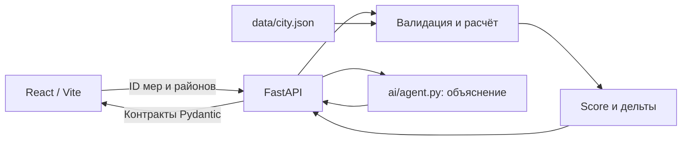

# Архитектура

Статус: стартовый сквозной каркас, численная модель реализована и покрыта тестами. AI пока mock; публичного деплоя и сохранения сценариев нет.

## Границы модулей

| Каталог | Ответственность | Владелец после передачи каркаса |
|---|---|---|
| `contracts/` | Pydantic v2, описание API, примеры, проверки совместимости | LEAD |
| `backend/app/main.py` | HTTP, CORS, обработка ошибок, связь расчёта с объяснением | LEAD |
| `backend/app/services/` | Чистая модель и бизнес-валидация; без сети и LLM | LEAD |
| `backend/app/seed.py` | Загрузка и проверка датасета; копия на каждый запрос | LEAD |
| `ai/` | Mock сейчас, live Responses API следующим шагом; импортирует только contracts | LEAD |
| `frontend/` | Выбор 5 мер, бюджет, результаты и объяснение | FRONTEND |
| `data/` | Синтетический датасет с происхождением и версией | OPS |
| `tests/e2e/`, `deploy/`, `docs/`, `README.md` | Сквозные проверки, публикация, инструкции | OPS |
| `scripts/`, `.githooks/` | Проверка сборки, экспорт примеров, контроль зон | LEAD |

Схемы не зависят от backend/ai. Движок не знает об HTTP. AI не импортирует backend: будущие инструменты передаются в `explain_scenario(..., tools=...)`. Данные AI берёт из результата сервера. Основной Score доступен без AI через `/evaluate`.

Каждый POST полностью пересчитывает состояние, поэтому нет сессий, гонок записи, смешения команд и накопления эффектов. UI хранит текущий набор решений в памяти. Для сохранения сценариев можно добавить слой `backend/app/repositories/` и SQLite, не меняя движок.

## Контракты и воспроизводимость

`contracts/schemas.py` — источник форматов. `/openapi.json` и `/docs` генерируются FastAPI. JSON-примеры отражают настоящие ответы; тест сравнивает их с текущим расчётом. Обновлять: `python -m scripts.export_contracts`.

Канонический файл — `data/city.json`. При его отсутствии используется копия `contracts/examples/catalog.json`. Повреждённый существующий файл вызывает ошибку, а не тихую подмену. Изменение данных требует новой версии, пересоздания примеров и тестов. Процесс загружает данные один раз; после изменения нужен перезапуск.

Зависимости Python зафиксированы в `requirements.txt`; frontend — в `package-lock.json`. Проверка не запускает серверы: pytest, импорт приложения, `npm run build`. Исходные серверы запускает пользователь отдельно.

## Следующие расширения

1. Live AI: OpenAI Responses API, Structured Outputs, таймаут/повтор, безопасный fallback, журнал режима провайдера без секретов.
2. Frontend: показатели до/после, подсветка `<40`, синергии и конфликты до отправки, сохранение сравниваемого набора локально.
3. OPS: публичный URL, health-check, инструкции восстановления и проверка доступности до 28.09.
4. После MVP: SQLite для сценариев/команд, audit log изменений, подтверждение AI-предложений, сравнение и события.

Официальные технические ориентиры: [FastAPI: тестирование](https://fastapi.tiangolo.com/tutorial/testing/), [Pydantic: модели](https://docs.pydantic.dev/latest/concepts/models/), [Vite: запуск и сборка](https://vite.dev/guide/).
